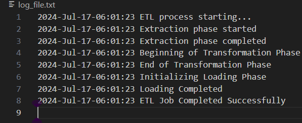

# ETL Process: Extracting Data From Multiple Files

This project aims at extracting data from multiple file formats i.e. JSON, CSV and XML and storing the data in PostgreSQL Database. 

### INSTRUCTIONS:

Your research team wished to investigate if there is any correlation between the height and weight of students attending HopeView Academy. 

The available raw files containing this information are available in [CSV, JSON and XML formats](Data_Files) with 3 files provided for each format. 

All the files contain 3 columns; **Name**(Student First Name), **Height** and **Weight**. Note that height is represented in inches and weight in pounds.


1. Extract the data from the raw file into a pandas dataframe. 

2. Transform the **Height** and **Weight** into **Meters** and **Kilograms** respectively.

3. Load the resulting dataframe in PostgreSQL database under the name '**HopeView_Academy_Data**'for further analysis

4. Create a log file that Logs the start and end of each ETL phase (extraction, transformation, and loading).


### SOLUTION:

#### 1. Data extraction phase

The project is an ETL (Extract, Transform, Load) process that extracts data from multiple file formats (CSV, JSON, XML), transforms the data, and loads it into a postgresql database, while logging the progress.

There are a couple of python libraries we will need to import to achieve the desired results as explained below.

. **glob:** Used to find all the file paths matching a specified pattern.

. **pandas:** A powerful data manipulation library.

. **xml.etree.ElementTree:** Used to parse XML files.

. **datetime:** Used to handle date and time for logging the transactions

. **psycopg2:** A PostgreSQL adapter for python that facilitates python to interacting with PostgreSQL.

. **sqlalchemy:** SQLAlchemy engine allows for easier interaction with the database.


The SQLAlchemy engine provides a powerful mechanism for generating and executing SQL expressions directly from Python code. SQLAlchemy allows you to write database-agnostic SQL queries using Python's native data types and syntax.

Similarly, SQLAlchemy abstracts the differences between various database engines (PostgreSQL, MySQL, SQLite, etc.). This allows you to write database code that is portable across different database systems without needing significant modifications.


```
import glob
import pandas as pd
import xml.etree.ElementTree as ET
from datetime import datetime
import psycopg2
from sqlalchemy import create_engine

log_file = "log_file.txt"

```


Next, we will create functions to extract data from each of the file formats as shows below:

```
def extract_csv(csv_file):
    dataframe = pd.read_csv(csv_file)
    return dataframe

def extract_json(json_file):
    dataframe= pd.read_json(json_file)
    return dataframe

def extract_xml(xml_file):
    dataframe = pd.DataFrame(columns=["Name", "Height", "Weight"])
    tree=ET.parse(xml_file)
    root=tree.getroot()
    for student in root.findall('Entry'):
        Name = student.find('Name').text
        Height = float(student.find('Height').text)
        Weight = float(student.find('Weight').text)
        dataframe = pd.concat([dataframe, pd.DataFrame([{"Name": Name, "Height": Height, "Weight":Weight}])], ignore_index = True)

    return dataframe
```

**def extract_csv(csv_file)** and **def extract_json(json_file)** function are pretty straight forward. They use the **pd.read_csv()** and **pd.read_json** functions in the Pandas library to read data from a CSV or JSON file respectively and convert it into a dataframe. Both functions then return the created DataFrame. 

The **def extract_xml(xml_file)** however is a little different. The data is contained inside tags. To access this data, we need to parse the XML file and access the elements based on their position (tags) as explained

- **ET.parse(xml_file):** Uses ElementTree from the xml.etree module to parse the XML file specified by xml_file.

- **Tree.getroot():** Retrieves the root element of the XML tree, which is typically the top-level element in the XML structure.

- The **For-loop** iterates through all the occurrences of the **<Entry>** tags using the **findall()** function.

- Next, we can retrieves the text contents of **Name**, **Height** and **Weight** from their respective tags using **find().text**

- **pd.DataFrame([{"Name": Name, "Height": Height, "Weight": Weight}]):**  Constructs a temporary DataFrame with a single row containing the extracted data column names (Name, Height, Weight).

- **pd.concat([dataframe, ...], ignore_index=True):** 
 Concatenates this temporary DataFrame with the existing dataframe. The ignore_index=True parameter ensures that the resulting DataFrame has a new continuous index.

Now that we have created extract functions that reads data from various file formats and stores the data in a dataframe, we need to create an extract function for all files. This function collects data from all CSV, JSON, and XML files in the specified directory and combines them into a single pandas DataFrame. This is where the **glob** library comes in handy.

**glob.glob(pattern)** returns a list of all files matching the specified *pattern* from our directory. We then call the appropriate function to extract data into a pandas dataframe based on whether a file ends with **.csv, .json, or .xml** extension.

The **Extract()** functions finally returns a dataframe that contains all the extracted data ending our extraction phase.


#### 2. Transformation phase

From the raw data, height and weight were recorded in inches and pounds respectively. In the transformation phase, we are required to convert inches and pounds values into Meters and Kilograms respectively. 

To achieve that we multiplied the **df.height** column with **0.0254** and rounded off to 2 decimal places. Similarly, we converted pounds to KGs by multiplying **df.Weight** by **0.45359237** and rounding off to 2 decimal place. 

##### NOTE:
 1 inch = 0.0254 Meters

 1 pound = 0.45359237 KGs

 The Transform function returns the transformed dataframe with the values converted as required. 


 #### 3. Loading Phase and Logging

The requirement is to load the final dataframe into a postgreSQL database named **HopeView_Academy_Data**. Once we have created our database using pgAdmin, all we need is to establish a connection to our postgreSQL database using **psycopg2** and create engine using SQLAlchemy to allow for easier interaction with the database. The following parameters need to be passes correctly as shown below:

```
def load_data(df):
    # Define connection parameters
    DATABASE = "HopeView_Academy_Data"
    USER = "postgres"
    PASSWORD = "************" # Enter your secret password set for the database
    HOST = "localhost"
    PORT = "5432"

    # Establish the connection
    conn = psycopg2.connect(
        database=DATABASE,
        user=USER,
        password=PASSWORD,
        host=HOST,
        port=PORT
    )

    # Create SQLAlchemy engine
    engine = create_engine(f'postgresql+psycopg2://{USER}:{PASSWORD}@{HOST}/{DATABASE}')
    df.to_sql('student_profile', engine, if_exists='replace', index=False)

    conn.close()

```
 Remember to always close the connection once the loading process is completed. 

Finally we are required to log the start and end of each ETL phase (extraction, transformation, and loading). The function below helps us achieve that
```
def log_progress(message):
    
    #changing Date and Time Format
    timestamp_format = '%Y-%h-%d-%H:%M:%S'
    now=datetime.now()
    timestamp= now.strftime(timestamp_format)

    #opening Log File in append mode
    with open(log_file, 'a') as f:
        f.write(timestamp+ ' '+ message+ ' \n')

```
The custom timestamp helps us to achieve similar logs, in our log file, as the one shown below.

`2024-Jul-17-06:01:23 Loading starting...`

Below is how to log each ETL process for this project
```
# Initializing the ETL process
log_progress("ETL process starting...")

#logging start of extraction process
log_progress("Extraction phase started")
raw_data = extract()

#logging end of extraction phase
log_progress("Extraction phase completed")

#logging beginning of transformation phase
log_progress("Beginning of Transformation Phase")
transformed_data = transform(extract())
print("Below is the transformed data: ")
print(transformed_data)

log_progress("End of Transformation Phase")

#Initializing the Loading Phase
log_progress("Initializing Loading Phase")
load_data(transformed_data)

#log completion of loading phase
log_progress("Loading Completed")

#ETL process Ended
log_progress("ETL Job Completed Successfully")
```


And our final log file will look similar to this:



END.


